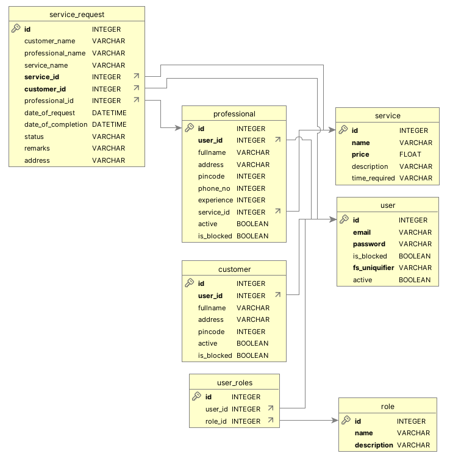

# 🏠 Household Services Application - V2

A multi-user household services platform designed for booking and managing home-related services. This application supports **three user roles**: Admin, Service Professional, and Customer—each with role-specific capabilities and secure access.

## 👨‍🎓 Student Details

- **Name:** Iftikhar Alam  
- **Roll Number:** 23f3003783  
- **Email ID:** [23f3003783@ds.study.iitm.ac.in](mailto:23f3003783@ds.study.iitm.ac.in)

## 📌 Project Summary

This project is built to streamline household service management by enabling customers to request services and professionals to offer them. The core objective is to ensure efficient service booking and role-based user interaction.

### 🎯 Objectives

- Build an efficient booking and service management platform.
- Implement a secure, role-based access system for distinct user experiences.

## 🛠️ Technologies Used

### Backend
- **Flask**
- **Flask-SQLAlchemy**
- **Flask-Security**

### Frontend
- **Vue.js**  
- **Bootstrap**

### Database
- **SQLite**

### Additional Tools
- **Redis** and **Celery** for asynchronous task handling  
- **Chart.js** for data visualization

## 🗂️ Project Architecture

The application follows the **MVC (Model-View-Controller)** pattern:
- **Model**: Handles data via SQLAlchemy
- **View**: Handled by Vue.js with Bootstrap for UI
- **Controller**: Flask-RESTful APIs controlling the app logic

## 🧩 Database Schema Design

The database schema manages relationships between users, services, and requests. Key models include:

- **User** – Stores user credentials and roles
- **Customer** – Stores customer details
- **Professional** – Stores professional details
- **Service** – Contains service metadata (name, price, description)
- **Service Request** – Logs service bookings
- **Role** – Defines user roles and permissions

📷 **Schema Diagram:**  

## 🌐 API Endpoints

- `GET/POST   /service_requests`
- `GET        /customers`
- `GET        /professionals`
- `GET        /services`
- `GET        /service/<int:service_id>/professionals/<int:user_id>`
- `GET        /services_requests/<int:user_id>`

---

